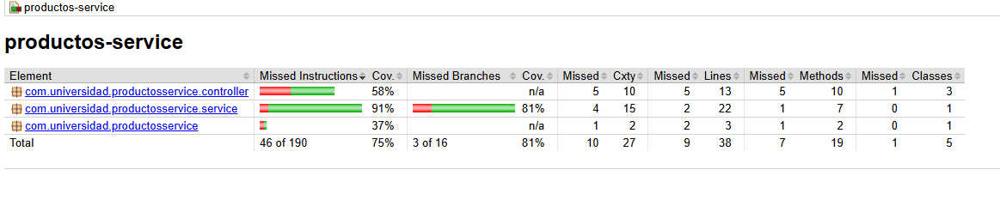
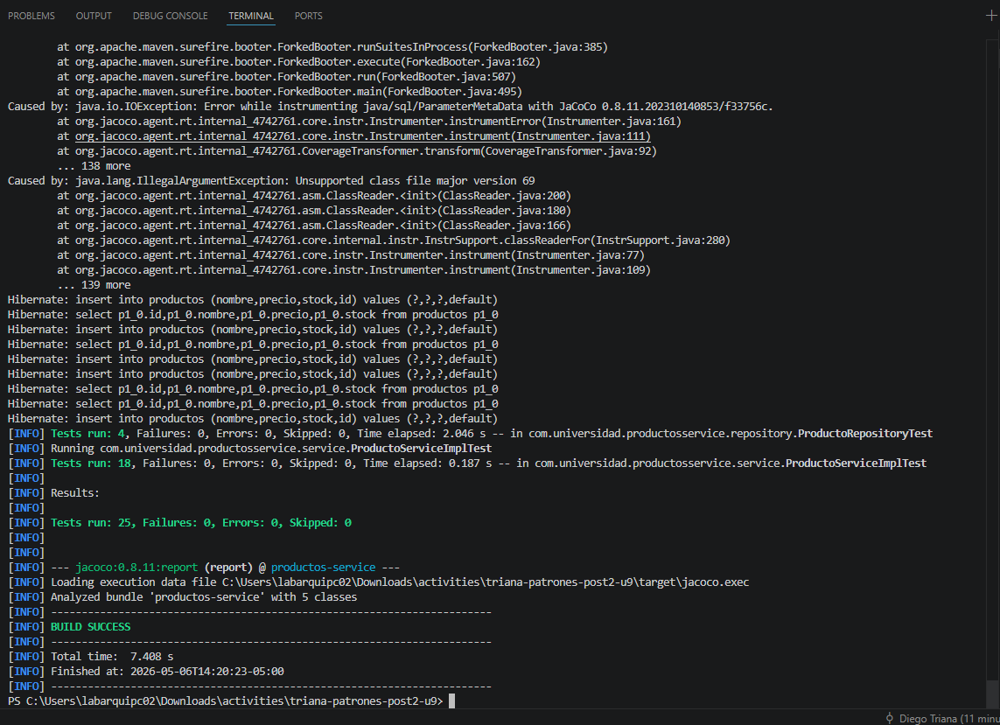

# Productos Service


Microservicio de gestion de productos para la actividad U9 Post-Contenido 2, con pruebas unitarias e integracion, cobertura JaCoCo y pipeline de CI en GitHub Actions.

## Tecnologias

- Java 21
- Spring Boot 3.3.12
- Spring Web + Spring Data JPA
- JUnit 5 + Mockito + MockMvc
- JaCoCo 0.8.11

## Ejecutar pruebas

```bash
mvn test
mvn verify
```

## Cobertura



Cobertura de lineas en `ProductoServiceImpl`: **85.71%**.

## Evidencia pruebas en verde


